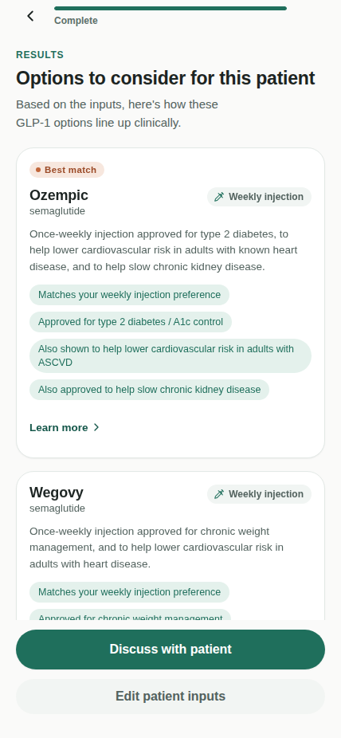

# GLP-1 Match

A clinician-facing iOS-style tool that matches a patient's profile — treatment goal, BMI range, diabetes status, delivery preference, and comorbidities — against real GLP-1 receptor agonist indications and current trial evidence. Built as a single self-contained HTML file with no build step and no dependencies.



## What it does

The app walks through a five-step intake (goal, BMI range, diabetes status, delivery preference, comorbidities), then a review screen summarizing all five answers — tap any one to jump straight back and change it, without re-clicking through the whole flow — before scoring six FDA-approved GLP-1 options — Wegovy, Zepbound, Ozempic, Mounjaro, Rybelsus, and the newly approved oral Wegovy tablet — against the inputs. Each result surfaces the specific approved indications and trial findings behind the match (for example, semaglutide's cardiovascular-risk-reduction indication in ASCVD, or semaglutide's chronic-kidney-disease indication in type 2 diabetes), a relative "close alternative" indicator against the top pick, and a "Learn more" panel with typical dosing, common side effects, and contraindications for that option. A banner flags the rare combination where no option is a strong match, so a low-confidence result never looks identical to a confident one.

It is decision support only. It does not replace clinical judgment, contraindication and drug-interaction screening, or shared decision-making with the patient — the app says so on its own results screen, along with collapsible, numbered references to the trial and meta-analysis literature it draws on.

## Running it

There's nothing to install or build. Open `index.html` directly in a browser, or serve the folder with any static file server:

```bash
python3 -m http.server 8000
# then open http://localhost:8000
```

On a phone-width viewport (iPhone 13 Pro Max class or narrower), the app fills the screen edge-to-edge using the device's own status bar and home indicator. On a wider viewport, it renders inside a decorative iPhone mockup for preview purposes.

## Live demo

If GitHub Pages is enabled for this repository (Settings → Pages → Source: GitHub Actions), the included workflow publishes `index.html` automatically on every push to `main`, at:

```
https://<your-username>.github.io/<repo-name>/
```

## Project structure

```
.
├── index.html              # the entire app — markup, styles, and logic in one file
├── VALIDATION.md            # independent 100-case accuracy check, method + results
├── validation/               # scripts that produced VALIDATION.md (not part of the shipped app)
├── docs/
│   └── screenshot.png       # image used in this README
└── .github/workflows/
    └── deploy-pages.yml     # GitHub Pages auto-deploy on push to main
```

## Evidence sources

The matching logic and indication text are grounded in four sources:

1. Moiz A, Filion KB, Toutounchi H, Tsoukas MA, Yu OHY, Peters TM, et al. Efficacy and safety of glucagon-like peptide-1 receptor agonists for weight loss among adults without diabetes: a systematic review of randomized controlled trials. Ann Intern Med. 2025;178(2):199–217. doi:10.7326/ANNALS-24-01590
2. Yao H, Zhang A, Li D, Wu Y, Wang CZ, Wan JY, et al. Comparative effectiveness of GLP-1 receptor agonists on glycaemic control, body weight, and lipid profile for type 2 diabetes: systematic review and network meta-analysis. BMJ. 2024;384:e076410. doi:10.1136/bmj-2023-076410
3. Rosen CJ, Ingelfinger JR. GLP-1 receptor agonists. N Engl J Med. 2026;394(13):1313–24. doi:10.1056/NEJMra2500106
4. Wharton S, Lingvay I, Bogdanski P, Duque do Vale R, Jacob S, Karlsson T, et al; for the OASIS 4 Study Group. Oral semaglutide at a dose of 25 mg in adults with overweight or obesity. N Engl J Med. 2025;393(11):1077–87. doi:10.1056/NEJMoa2500969

These same four references appear on the app's own results screen.

## Validation

The matching algorithm was independently checked against 100 randomly generated patient profiles, graded by logic written fresh from the source papers (not from the app's own code): 88% exact match, 92% evidence-consistent overall, after fixes to delivery-preference weighting and, most recently, oral-delivery goal-matching following the addition of oral Wegovy. See [VALIDATION.md](VALIDATION.md) for the full method, all three rounds of results, and an honest breakdown of every remaining mismatch. The scripts that produced it are in `validation/`.

## Accessibility

Colors are checked against WCAG AA (4.5:1 minimum for body and small text); interactive targets meet the 44×44pt minimum; keyboard focus is visible throughout; `prefers-reduced-motion` is respected; and the page adapts to system light/dark mode.

## Disclaimer

This tool is decision support only. It is not a medical device and has not been cleared or reviewed by the FDA. It summarizes published indications and trial evidence, and does not replace clinical judgment, a full review of the patient's chart, contraindication and drug-interaction screening, or shared decision-making with the patient. The prescribing clinician is solely responsible for all treatment decisions. Medication indications and trial findings summarized here can change as new evidence emerges — always confirm current FDA labeling and guidelines before applying them to patient care. The app repeats a version of this disclaimer on its own intro and results screens.

## License

See [LICENSE](LICENSE). Copyright © 2026 MDGadgetz LLC.

## Developer

Developed by MDGadgetz LLC.
